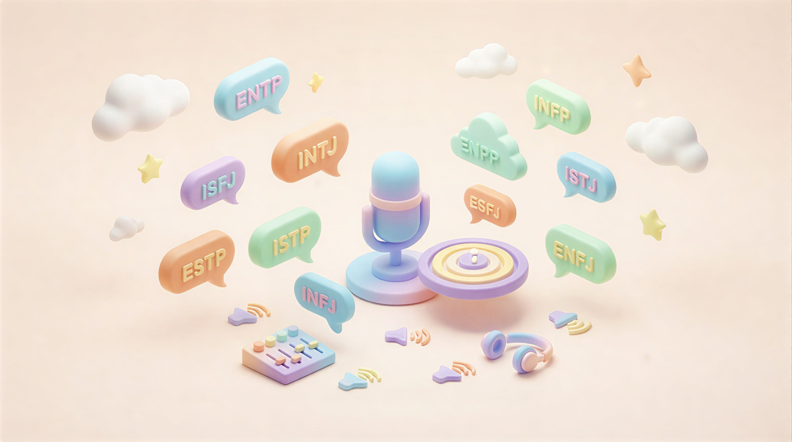

<p align="center">
  
</p>

<h1 align="center">
  <strong>MindCast</strong>
</h1>

<p align="center">
  <em>多智能体 AI 播客系统 — 任意话题深度解读</em>
</p>

<p align="center">
  <a href="https://python.org/"></a>
  <a href="https://fastapi.tiangolo.com/"></a>
  <a href="https://vuejs.org/"></a>
  <a href="https://langchain-ai.github.io/langgraph/"></a>
  <a href="LICENSE"></a>
</p>

---

<p align="center">
  
</p>

## 📖 简介

**MindCast 是一款多智能体 AI 播客创作工具，能轻松打造专业级深度播客节目。**

只需输入一个话题，MindCast 的多位 AI 嘉宾就会像真实的播客主播一样——他们有个性、有观点、甚至会即兴抢话——在思维碰撞中为听众带来深度解读。你可以设计不同 **MBTI 人格**、职业、角色特性、音色等属性的AI角色，从 ENFJ 主持人到 INTJ 技术专家、INFP 人文观察者，每位嘉宾都带着真实的性格底色参与播客对话，产生不同的思维碰撞。

**你可以选择**：一键生成完整音频节目（含语音合成与混音），或先审阅文稿、编辑润色后再合成。每期节目还会自动生成配套的深度长文，让你的内容一键多态、随处可用。

---

## ✨ 核心特性

| 特性 | 说明 |
|:---|:---|
| 🤖 **多智能体全自动生成** | LangGraph 10 节点流水线：资讯 → 选题 → 研究 → 检索 → 规划 → 对话 → 文章 → TTS → 拼装 → 保存 |
| ✏️ **两阶段创作模式** | ，先生成纯文稿预览编辑，确认后再触发 TTS 合成；或一键全自动端到端 |
| 📄 **文档驱动模式** | 上传 PDF / DOCX / TXT / Markdown，系统解析后存入 ChromaDB，基于文档内容自动推导话题并生成播客 |
| 🎙️ **中断机制** | 对话生成时允许激活抢话、接话逻辑，模拟真实播客即兴互动 |
| 🧠 **RAG 优先研究** | 先查 ChromaDB 知识库，新鲜则跳过联网，陈旧才回退 Tavily 实时搜索 |
| 📰 **智能去重选题** | 读取近 20 期历史话题，避免重复，保持节目新鲜感 |
| 📝 **衍生长文生成** | 对话完成后自动生成对应深度文章（存入 `episode.article`） |
| 👥 **嘉宾池完整 CRUD** | 前端可增删改嘉宾，AI 可从自然语言描述一键生成完整人设 |
| 🎭 **深度去 AI 化** | 确保生成内容无 AI 味，自然流畅 |
| 🗄️ **知识库管理** | 每期节目可手动或自动导入 ChromaDB，跨期持续沉淀知识 |

---

## 🔄 生成流水线

```
┌─────────────┐
│  Tavily 新闻  │
└──────┬──────┘
       │
       ▼
  ┌────────────┐    ┌────────────┐    ┌────────────────┐
  │ fetch_news │───►│select_topic│───►│ deep_research  │
  └────────────┘    └────────────┘    └───────┬────────┘
                                               │
                                    ┌──────────┴──────────┐
                                    │   RAG-first (ChromaDB)   
                                    │   Tavily fallback (陈旧时)
                                    └──────────┬──────────┘
                                               │
                                               ▼
                                    ┌────────────────────┐
                                    │   retrieve_rag     │
                                    └─────────┬──────────┘
                                              │
                                              ▼
                                    ┌────────────────────┐
                                    │   plan_episode    │
                                    │ (话题+大纲+冲突设计) │
                                    └─────────┬──────────┘
                                              │
                                              ▼
                                    ┌────────────────────┐
                                    │ generate_dialogue  │
                                    │ (多角色轮流/随机中断) │
                                    └─────────┬──────────┘
                                              │
                                              ▼
                                    ┌────────────────────┐
                                    │ generate_article   │
                                    │  (对话转深度文章)    │
                                    └─────────┬──────────┘
                                              │
                                              ▼
                                    ┌────────────────────┐
                                    │ synthesize_tts     │────► MiniMax speech-2.8-hd
                                    └─────────┬──────────┘
                                              │
                                              ▼
                                    ┌────────────────────┐
                                    │   stitch_audio     │────► ffmpeg 拼装
                                    └─────────┬──────────┘
                                              │
                                              ▼
                                    ┌────────────────────┐
                                    │   save_episode    │────► output/episodes/{id}.json/.wav
                                    └────────────────────┘
```

---

## 📄 文档驱动模式

除话题模式外，MindCast 支持以**上传文档**作为播客内容来源：

```
用户上传文档 (PDF / DOCX / TXT / Markdown)
       │
       ▼
  解析 & 分块 (800字/块，100字重叠)
       │
       ▼
  存入 ChromaDB (task 作用域，按 session_id 隔离)
       │
       ▼
  LLM 从文档摘要推导播客话题
       │
       ▼
  deep_research (优先查询上传文档 + 全局知识库，不足则 Tavily 补充)
       │
       ▼
  后续同话题模式（规划 → 对话 → 文章 → TTS → 保存）
```

### 上传文档 API

```http
POST /api/documents/upload
Content-Type: multipart/form-data

files: [file1.pdf, file2.docx, ...]   # 最多 20 MB / 文件
```

**响应：**
```json
{
  "document_session_id": "a1b2c3d4e5f6",
  "files": [
    {"filename": "report.pdf", "status": "ok", "chunks": 12, "char_count": 9600}
  ],
  "total_chunks": 12
}
```

将返回的 `document_session_id` 传入 `/api/generate` 或 `/api/script/preview/task` 即可触发文档模式生成。

> 🔑 **支持格式**：`.pdf`、`.docx`、`.doc`、`.txt`、`.text`、`.md`、`.markdown`（单文件 ≤ 20 MB）

---

## 🎭 角色人设

| 角色 | 名字 | MBTI | 职业 | 特点 |
|:---|:---|:---|:---|:---|
| 🦉 主持人 | 晨曦 | ENFJ | 科技媒体主编 | 温和引导，善于追问动机 |
| 🧑‍💻 嘉宾 | 兆明 | INTJ | 技术专家 | 数据驱动，喜欢拆解底层逻辑 |
| 🎓 嘉宾 | 恒宇 | INFP | 社会学大学教授 | 人文关怀，关注技术的社会代价 |

> 💡 **嘉宾池完全可定制**：前端可增删改人设，也可用自然语言描述让 AI 自动生成完整角色。

---

## 📁 项目结构

```
MindCast/
├── main.py                      # FastAPI 应用入口
├── pyproject.toml               # Python 项目配置 & 依赖
├── package.json                # Node 脚本（一键启动 / Docker）
├── Dockerfile                  # 后端镜像（多阶段 uv + python:3.13-slim）
├── docker-compose.yml          # 全栈编排（backend + frontend/nginx）
├── LICENSE                     # MIT 开源协议
├── .env.example                # 环境变量模板
│
├── backend/                    # ── 后端源码 ──
│   ├── config.py              # 全局配置（pydantic-settings，支持热重载）
│   ├── models.py              # Pydantic 数据模型
│   ├── agents/                # LangGraph 多智能体
│   │   ├── orchestrator.py   # 主编排图（10 节点流水线）
│   │   ├── host.py           # 主持人 Agent（选题 / 规划 / RAG 决策）
│   │   ├── guest.py          # 嘉宾 Agent（分角色轮流生成对话）
│   │   └── personas.py       # 角色人设 / 系统提示词 / 音色库
│   ├── api/
│   │   ├── routes.py         # 全部 API 路由（含调试端点）
│   │   └── schemas.py        # 请求 / 响应 Schema
│   ├── services/             # 业务服务层
│   │   ├── llm_service.py    # OpenAI-compatible LLM 封装
│   │   ├── tts_service.py    # MiniMax T2A v2 语音合成
│   │   ├── news_service.py   # Tavily 新闻检索
│   │   ├── audio_service.py  # pydub + ffmpeg 音频拼装 & 归一化
│   │   ├── document_service.py   # 文档解析 & ChromaDB 写入（PDF/DOCX/TXT/MD）
│   │   ├── guest_pool_service.py  # 嘉宾池 CRUD
│   │   ├── host_service.py   # 主持人配置
│   │   └── run_logger.py    # 节目结构化日志
│   └── knowledge/            # RAG / ChromaDB 知识库接口
│
├── frontend/                   # ── Vue 3 + Vite 前端 ──
│   ├── Dockerfile            # 多阶段构建 → nginx:alpine
│   ├── nginx.conf           # SPA + /api 反向代理
│   └── src/
│       ├── views/           # Home（工作流）、Episode（详情页）
│       ├── components/      # WorkflowWizard / GuestDrawer / PodcastPlayer …
│       └── stores/          # Pinia 全局状态
│
├── tests/                     # 后端单元测试（pytest）
├── scripts/
│   └── run_text_pipeline.py # 仅文本模式（跳过 TTS，快速调试）
│
├── data/                      # 本地持久化
│   ├── guest_pool.json       # 嘉宾池
│   ├── host.json             # 主持人配置
│   └── chromadb/            # ChromaDB 向量库 ⚠️ gitignored
├── output/episodes/          # 已生成节目 ⚠️ gitignored
└── docs/
    └── assets/              
```

---

## 🚀 快速开始

### 前置依赖

| 依赖 | 版本要求 | 用途 |
|:---|:---|:---|
| 🐍 **Python** | ≥ 3.13 | 后端运行时 |
| 📦 **uv** | 最新版 | Python 依赖管理 |
| 🌐 **Node.js** | ≥ 18 | 前端开发 & npm 脚本 |
| 🔊 **ffmpeg** | 系统安装 | 音频拼装与归一化 |
| 🐳 **Docker** | Compose v2 | 可选 · 容器化部署 |

### 配置环境变量

```bash
# 复制环境变量模板
cp .env.example .env

# 编辑 .env，填入以下 API Keys：
#   LLM_API_KEY       — DeepSeek / 任何 OpenAI-compatible 服务
#   TAVILY_API_KEY    — tavily.com（新闻检索）
#   MINIMAX_API_KEY   — minimaxi.com（TTS 语音合成）
#   MINIMAX_GROUP_ID  — minimaxi.com（Group ID）
```

> 💡 也可在启动后通过前端「设置」面板填写，会自动写入 `.env` 并热重载，无需重启。

---

### 方式一：本地开发（推荐）

```bash
# 一键安装所有依赖（仅首次）
npm run setup:all

# 同时启动前后端
npm run dev
```

| 服务 | 地址 |
|:---|:---|
| 🎨 前端 | http://localhost:5173 |
| ⚡ 后端 API | http://localhost:8000 |
| 📚 Swagger 文档 | http://localhost:8000/docs |

**分步启动：**
```bash
npm run backend    # 仅后端
npm run frontend   # 仅前端
```

---

### 方式二：Docker 部署

```bash
# 构建并启动（约 2–3 分钟）
npm run docker:up

# 查看实时日志
npm run docker:logs

# 停止服务
npm run docker:down
```

启动后访问 **http://localhost**（80 端口），nginx 自动将 `/api` 请求代理到后端容器。

> ⚠️ `.env` 文件会通过 `env_file` 挂载到后端容器，生产部署前请确保 API Keys 已配置。

---

### 方式三：纯 Python 脚本

```bash
# 安装依赖
uv sync

# 命令行运行完整流水线（跳过 TTS / 音频，快速验证）
uv run python scripts/run_text_pipeline.py --topic "AI Agent 发展"

# 指定嘉宾
uv run python scripts/run_text_pipeline.py --topic "量子计算" --guests 兆明 恒宇
```

---

## 📦 输出产物

每期节目生成后保存在 `output/episodes/{episode_id}/`：

```
output/episodes/
└── abc123def456/
    ├── episode.json    # 完整节目数据
    ├── episode.wav    # 合成音频
    └── logs/
        └── run.jsonl  # 执行日志
```

### episode.json 结构

```json
{
  "id": "abc123def456",
  "topic": "AI Agent 发展趋势",
  "created_at": "2024-01-15T10:30:00Z",
  "plan": { ... },
  "dialogue": [
    {"speaker": "晨曦", "text": "...", "voice_id": "..."},
    {"speaker": "兆明", "text": "...", "voice_id": "..."}
  ],
  "article": "...",
  "duration_seconds": 300
}
```

---

## 📊 数据流

```
用户输入话题
       │
       ▼
┌──────────────────┐
│ LangGraph Pipeline │
└────────┬─────────┘
         │
    ┌────┴────┐
    │          │
    ▼          ▼
 News      HostAgent
Service    (选题/RAG)
    │          │
    └────┬────┘
         │
         ▼
┌──────────────────┐
│ GuestAgent × N   │ ◄── 多角色对话生成
└────────┬─────────┘
         │
         ▼
┌──────────────────┐
│   TTS Service    │ ◄── MiniMax 语音合成
└────────┬─────────┘
         │
         ▼
┌──────────────────┐
│  Audio Service   │ ◄── ffmpeg 拼装
└────────┬─────────┘
         │
         ▼
   本地文件系统持久化
```

---

## 🔗 相关资源

- 📖 [LangGraph 官方文档](https://langchain-ai.github.io/langgraph/)
- 🎙️ [MiniMax TTS API](https://platform.minimaxi.com/)
- 📰 [Tavily 搜索 API](https://tavily.com/)
- 🗄️ [Chroma 向量数据库](https://www.trychroma.com/)
- 🐙 [DeepSeek LLM](https://www.deepseek.com/)

---

<div align="center">

**如果这个项目对你有帮助，请给个 ⭐️ Star 支持一下！**

</div>
